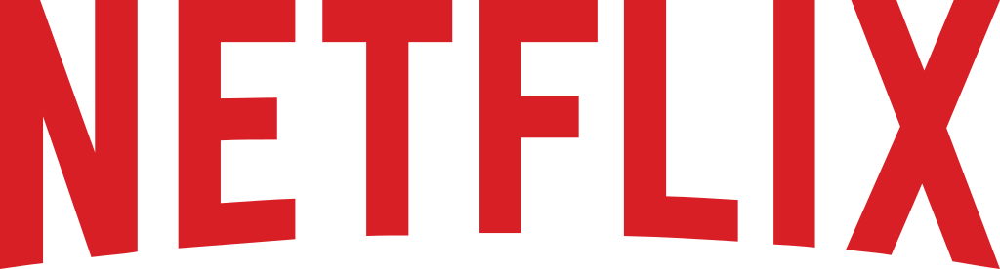

<p align="center">
  
</p>

<h1 align="center">Write Like Netflix</h1>

<p align="center">
  <strong>AI skills that teach assistants to write engineering blogs the way Netflix does.</strong><br/>
  Trained on the complete Netflix TechBlog archive — 800+ posts (2017–2026).
</p>

<p align="center">
  
  
  
  
</p>

---

Netflix engineering blogs are famous for a reason: real systems at real scale,
numbers over adjectives, architecture diagrams where others use paragraphs.
**Write Like Netflix** distills that style into AI skills — Claude Code,
OpenCode, and any agent that loads skills — so anyone can produce
technical writing with the same density and rigor.

Every rule is quantified. Every technique traces to real Netflix posts.
No generic writing advice.

## ✨ Features

| Skill | What it does |
|---|---|
| `netflix-topics` | Finds topics worth writing about, scored the Netflix way |
| `netflix-titles` | Crafts titles that earn the click |
| `netflix-series` | Plans multi-part deep dives |
| `netflix-research` | Turns code, docs, and experiments into evidence |
| `netflix-interview` | Turns a 30-min engineer convo into an outline |
| `netflix-data-story` | Frames numbers as baseline → intervention → measured delta |
| `netflix-code` | Picks the minimal snippets that carry the story |
| `netflix-hook` | Writes first-150-words openers in 5 proven archetypes |
| `netflix-write` | Drafts the full post to per-section budgets |
| `netflix-visuals` | Places the right figure in the right spot, with captions |
| `netflix-review` | Scores any draft like a Netflix editor — with fixes |
| `netflix-factcheck` | Verifies every claim against its source |
| `netflix-blog` | Router — picks the right skills in the right order |

## 📊 The corpus behind it

- **800+** Netflix TechBlog posts, 2017–2026
- Full text as markdown, with **figures, captions, and metadata**
- Powers quantitative style profiles: structure, voice, titles, topics, visuals

## 🚀 Use

```bash
git clone https://github.com/manish-9245/Netflix-Techblog.git
# point your agent at the skills/ directory
```

Works with [Claude Code](https://docs.anthropic.com/en/docs/claude-code),
[OpenCode](https://opencode.ai/docs), and any skill-compatible AI assistant.

## 📜 License

Skills and code are MIT. Post content studied belongs to Netflix.
